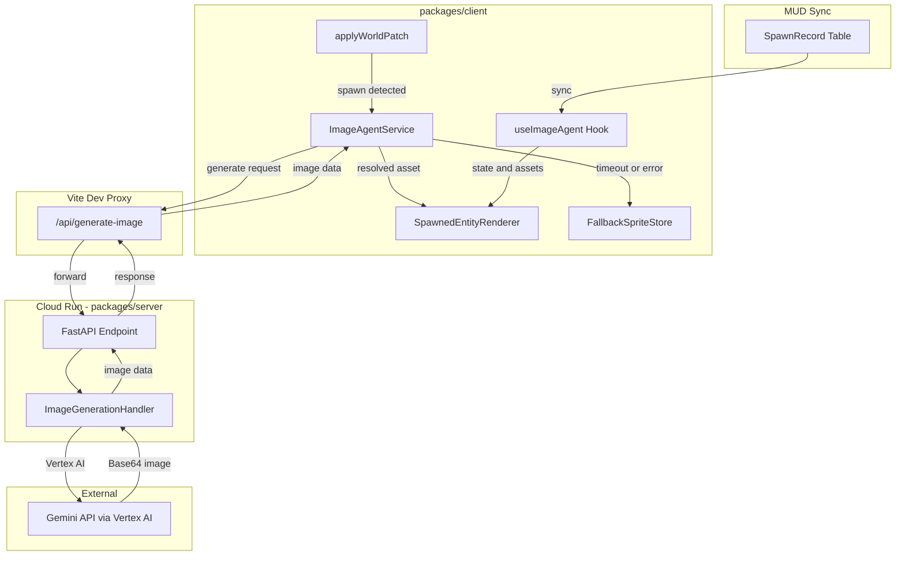
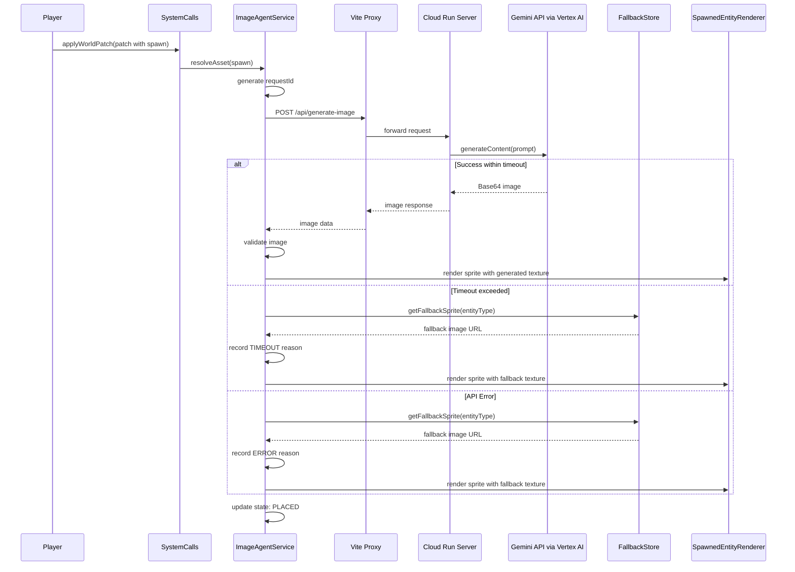
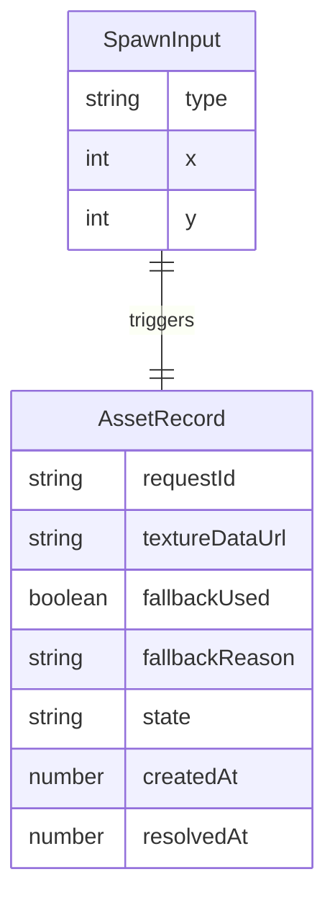

# Technical Design — Image Agent Service

## Overview

**Purpose**: ワールドパッチ JSON の `spawn` パラメータを起点に、Gemini API（Nano Banana）でピクセルアセットを動的に生成し、Three.js 空間内にスプライトとして配置する Image Agent Service を提供する。

**Users**: プレイヤーは発話後の世界変化を即座に視覚的に確認でき、運用者は生成状態とフォールバック状況を追跡できる。

**Impact**: 既存の `createSystemCalls` → `applyWorldPatch` フローに画像生成レイヤーを挿入し、スポーン時のエンティティ表現を汎用ジオメトリからAI生成ピクセルアセットへ進化させる。画像生成 API は `packages/server/` の FastAPI エンドポイントとして実装し、Cloud Run 上にデプロイする。

### Goals
- スポーン指定から画像アセットの解決・配置までを自動化する
- API 失敗・遅延時にフォールバック画像で体験を止めない
- 要求ごとの状態遷移（受付→生成→配置）を追跡可能にする

### Non-Goals
- マルチターン画像編集（将来検討）
- サーバーサイドの永続キャッシュ層
- オンチェーンへの画像データ保存
- 複雑なカテゴリ別フォールバックマッピング（MVP外）

## Architecture

### Existing Architecture Analysis

現在のシステムは以下の構造で動作している：
- **Contract Layer**: `WorldPatchSystem.sol` が `spawnEntity` で `SpawnRecord` テーブルに書き込み
- **Sync Layer**: MUD の `syncToRecs` がオンチェーン変更をクライアントの RECS コンポーネントへ同期
- **Client Layer**: `createSystemCalls.ts` が `applyWorldPatch` を提供し、React コンポーネントが `useMUD()` + `useEntityQuery` でエンティティを表示

**現在の制約**:
- スポーンされたエンティティの表現は `App.tsx` 内のハードコード `<mesh>` のみ
- 画像アセットの解決機構は存在しない
- フォールバックスプライトのディレクトリも事前画像も未整備

**既存インフラ**:
- `packages/server/` に FastAPI + Python サーバーが既に存在し、Cloud Run へのデプロイパイプライン（`Dockerfile`, `deploy.sh`）が構築済み
- Voice Agent と同一の Cloud Run サービスに画像生成エンドポイントを追加する形が最も効率的

### Architecture Pattern & Boundary Map



**Architecture Integration**:
- Selected pattern: Client-side Service Layer + Cloud Run Server Endpoint（`packages/server/` 既存インフラを活用）
- Domain boundaries: 画像生成ロジックは `packages/server/` に配置し、クライアント側は `packages/client/src/services/` にサービス層を持つ。MUD 同期ロジック（`src/mud/`）やUI（`src/App.tsx`）と分離
- Existing patterns preserved: `MUDContext` 経由のデータ取得、`createSystemCalls` による操作、`packages/server/` の FastAPI + Cloud Run デプロイパターン
- New components rationale: 画像生成の非同期処理・フォールバック・状態管理は既存のどのレイヤーにも属さないため、専用サービス層が必要。APIキーはサーバーサイド（Cloud Run）で管理
- Steering compliance: `client -> contracts` の依存方向を維持、API キーはサーバー側のみ保持

### Technology Stack

| Layer | Choice / Version | Role in Feature | Notes |
|-------|------------------|-----------------|-------|
| Frontend | React + `@react-three/fiber` | スプライト配置と状態表示 | 既存スタック |
| Backend / Server | Python + FastAPI (packages/server) | 画像生成 API エンドポイント | Cloud Run 上で実行 |
| Image Generation | `@google/genai` (Python) | Gemini API 画像生成 | Vertex AI 経由、`gemini-2.0-flash-preview-image-generation` モデル |
| Infrastructure | Cloud Run + Artifact Registry | サーバーデプロイ | 既存の `deploy.sh` + `Dockerfile` を拡張 |
| Dev Proxy | Vite server.proxy | 開発時のリクエスト転送 | `/api/generate-image` → Cloud Run / localhost:8080 |
| State Management | React useState/useRef | 要求ごとの状態追跡 | 軽量で十分 |

## System Flows

### スポーン→画像生成→配置フロー



**Key Decisions**:
- タイムアウトは `Promise.race` パターンで実装し、生成とタイマーを競合させる
- フォールバック採用時のログには理由区分（`TIMEOUT` / `ERROR`）を記録

## Requirements Traceability

| Requirement | Summary | Components | Interfaces | Flows |
|-------------|---------|------------|------------|-------|
| 1.1 | spawn を画像アセット解決要求として受理 | ImageAgentService | resolveAsset | スポーン→配置フロー |
| 1.2 | 空値・不正形式の spawn を検証エラーとして扱う | ImageAgentService | validateSpawnInput | — |
| 1.3 | 一意な要求識別子を付与 | ImageAgentService | generateRequestId | — |
| 1.4 | 生成要求と元パッチの対応関係を保持 | ImageAgentService | requestStore (state) | — |
| 2.1 | 生成結果の受理可否判定 | ImageAgentService | validateGeneratedImage | スポーン→配置フロー |
| 2.2 | 破損・非対応形式を無効として扱う | ImageAgentService | validateGeneratedImage | — |
| 2.3 | 受理画像に spawn 対応メタデータを保持 | ImageAgentService | AssetRecord (state) | — |
| 2.4 | Three.js 側へ受け渡し可能な参照情報を提供 | ImageAgentService, SpawnedEntityRenderer | getTextureRef | — |
| 3.1 | API エラー時にフォールバック画像を選択 | FallbackSpriteStore | getFallbackSprite | フォールバック分岐 |
| 3.2 | タイムアウト時にフォールバック即時採用 | ImageAgentService | resolveAsset (timeout) | タイムアウト分岐 |
| 3.3 | フォールバック採用理由を記録 | ImageAgentService | logFallbackReason | — |
| 3.4 | フォールバック時も同等の表示フローで配置 | SpawnedEntityRenderer | — | フォールバック分岐 |
| 3.5 | フォールバック採用から1秒以内に表示可能状態へ遷移 | FallbackSpriteStore | preload | — |
| 4.1 | アセット確定時にスポーンイベントを通知 | ImageAgentService, useImageAgent | onAssetResolved | スポーン→配置フロー |
| 4.2 | 位置・向き・識別子を含む配置情報を提供 | SpawnedEntityRenderer | SpawnPlacement type | — |
| 4.3 | 配置先情報欠落時に既定配置を使用 | SpawnedEntityRenderer | DEFAULT_PLACEMENT | — |
| 4.4 | 同一識別子による重複配置を防止 | useImageAgent | placedEntitySet | — |
| 5.1 | 状態遷移を記録 | ImageAgentService | RequestState enum | — |
| 5.2 | フォールバック率しきい値超過時に警告 | ImageAgentService | checkFallbackRate | — |
| 5.3 | 重複要求の集約・順序制御 | ImageAgentService | deduplicateRequests | — |
| 5.4 | 要求識別子で結果を相互照合可能に | ImageAgentService | requestStore | — |

## Components and Interfaces

| Component | Domain/Layer | Intent | Req Coverage | Key Dependencies | Contracts |
|-----------|--------------|--------|--------------|------------------|-----------|
| ImageGenerationEndpoint | Server (Cloud Run) | Gemini API を呼び出して画像を生成・返却 | 2.1 | Gemini API via Vertex AI (P0) | API |
| ImageAgentService | Client Service | 画像生成要求の管理、サーバー呼び出し、フォールバック判定 | 1.1-1.4, 2.1-2.4, 3.1-3.5, 5.1-5.4 | Cloud Run Server (P0), FallbackSpriteStore (P0) | Service, State |
| FallbackSpriteStore | Client Service | フォールバック用予備画像の管理と提供 | 3.1, 3.4, 3.5 | なし | Service |
| useImageAgent | Hook | ImageAgentService と React コンポーネントの橋渡し | 4.1, 4.4 | ImageAgentService (P0), MUDContext (P0) | State |
| SpawnedEntityRenderer | UI | Three.js 空間内でスプライトを配置・表示 | 2.4, 4.1-4.4 | useImageAgent (P0), R3F (P0) | — |
| Vite Proxy Config | Infra | 開発時のリクエスト転送 | — | Vite (P0) | — |

### Service Layer

#### ImageAgentService

| Field | Detail |
|-------|--------|
| Intent | spawn 入力から画像アセットの解決までを一貫して管理する |
| Requirements | 1.1, 1.2, 1.3, 1.4, 2.1, 2.2, 2.3, 3.1, 3.2, 3.3, 5.1, 5.2, 5.3, 5.4 |

**Responsibilities & Constraints**
- spawn パラメータのバリデーションと要求識別子の生成
- Gemini API への画像生成リクエスト発行と結果のバリデーション
- タイムアウト制御とフォールバック判定
- 要求ごとの状態遷移管理と可観測性ログ
- 重複要求の検知と集約

**Dependencies**
- Outbound: Cloud Run Server (`/api/generate-image`) → Gemini API via Vertex AI — 画像生成 (P0)
- Outbound: FallbackSpriteStore — フォールバック画像取得 (P0)
- Inbound: useImageAgent Hook — React 側からの呼び出し (P0)

**Contracts**: Service [x] / State [x]

##### Service Interface
```typescript
type RequestId = string;

type RequestState =
  | "ACCEPTED"
  | "GENERATING"
  | "GENERATED"
  | "GENERATION_FAILED"
  | "TIMEOUT_FALLBACK"
  | "PLACED";

type FallbackReason = "API_ERROR" | "TIMEOUT" | "INVALID_IMAGE";

interface SpawnInput {
  type: string;
  x: number;
  y: number;
}

interface AssetRecord {
  requestId: RequestId;
  spawnInput: SpawnInput;
  textureDataUrl: string | null;
  fallbackUsed: boolean;
  fallbackReason: FallbackReason | null;
  state: RequestState;
  createdAt: number;
  resolvedAt: number | null;
}

interface ImageAgentServiceInterface {
  resolveAsset(spawnInput: SpawnInput): Promise<AssetRecord>;
  getRequestState(requestId: RequestId): RequestState | null;
  getAssetRecord(requestId: RequestId): AssetRecord | null;
  getFallbackRate(): number;
}
```
- Preconditions: `spawnInput` は `validateSpawnInput` を通過済みであること
- Postconditions: 返却される `AssetRecord` は必ず `textureDataUrl` が非null（フォールバック含む）
- Invariants: 各 `requestId` に対して状態は単調に進行する（逆行しない）

##### State Management
- State model: `Map<RequestId, AssetRecord>` をインメモリで保持
- Persistence: セッション中のみ（リロードでリセット）
- Concurrency: 同一 `spawnInput` に対する並行リクエストは `requestId` の先勝ちで集約

---

#### FallbackSpriteStore

| Field | Detail |
|-------|--------|
| Intent | フォールバック用予備画像の事前読み込みと提供 |
| Requirements | 3.1, 3.4, 3.5 |

**Responsibilities & Constraints**
- `public/fallback-sprites/` からフォールバック画像をプリロード
- `entityType` に対応するフォールバック画像の解決（MVP は汎用1枚）
- 1秒以内の提供を保証するための事前キャッシュ

**Dependencies**
- External: `public/fallback-sprites/` — 静的アセット (P0)

**Contracts**: Service [x]

##### Service Interface
```typescript
interface FallbackSpriteStoreInterface {
  preload(): Promise<void>;
  getFallbackSprite(entityType: string): string;
  isReady(): boolean;
}
```
- Preconditions: `preload()` が完了していること（`isReady() === true`）
- Postconditions: `getFallbackSprite` は常に有効な画像URLを返す
- Invariants: フォールバック画像の読み込み失敗時はインラインの最小SVGを返す

### Hook Layer

#### useImageAgent

| Field | Detail |
|-------|--------|
| Intent | ImageAgentService と React/R3F コンポーネントを接続する |
| Requirements | 4.1, 4.4 |

**Responsibilities & Constraints**
- `SpawnRecord` の MUD 同期イベントを監視し、新規スポーンを検知
- 検知したスポーンに対して `ImageAgentService.resolveAsset` を呼び出し
- 解決済みアセットのリストを React state として公開
- 重複配置防止のための `placedEntitySet` 管理

**Dependencies**
- Inbound: SpawnedEntityRenderer — アセット一覧取得 (P0)
- Outbound: ImageAgentService — アセット解決 (P0)
- External: `@latticexyz/react` — `useEntityQuery`, `useComponentValue` (P0)

**Contracts**: State [x]

##### State Management
```typescript
interface UseImageAgentReturn {
  spawnedAssets: ReadonlyArray<AssetRecord>;
  isProcessing: boolean;
  fallbackRate: number;
}
```

### UI Layer

#### SpawnedEntityRenderer

| Field | Detail |
|-------|--------|
| Intent | 解決済み画像アセットをThree.js空間にスプライトとして配置する |
| Requirements | 2.4, 4.1, 4.2, 4.3, 4.4 |

**Responsibilities & Constraints**
- `useImageAgent` から取得したアセット一覧をスプライトとして3D空間に描画
- 位置情報 (`x`, `y`) を3D座標に変換
- 配置先情報が欠落する場合に既定座標 `(0, 0, 0)` を使用
- 同一 `requestId` のスプライト重複を防止

**Dependencies**
- Inbound: useImageAgent — アセット一覧 (P0)
- External: `@react-three/fiber` — React Three コンポーネント (P0)

**Implementation Notes**
- R3F の `<sprite>` + `<spriteMaterial>` を使用
- テクスチャは `TextureLoader` で Data URL から生成
- 位置は `spawn.x`, `spawn.y` を XZ 平面にマッピングし、Y は固定高さ

### Server Layer (Cloud Run)

#### ImageGenerationEndpoint

| Field | Detail |
|-------|--------|
| Intent | Gemini API を Vertex AI 経由で呼び出し、生成画像を返却する FastAPI エンドポイント |
| Requirements | 2.1（画像生成の実行基盤） |

**Responsibilities & Constraints**
- `POST /api/generate-image` エンドポイントとして画像生成リクエストを受け付ける
- エンティティ種別からピクセルアート向けプロンプトを構築する
- `google-genai` Python SDK を使い Vertex AI 経由で Gemini API を呼び出す
- `GOOGLE_GENAI_USE_VERTEXAI=TRUE` 環境変数でアクセス制御（IAM ベース、API キー不要）
- 生成画像を Base64 形式でクライアントへ返却する

**Dependencies**
- External: Gemini API via Vertex AI — 画像生成 (P0)
- Inbound: Client ImageAgentService — HTTP リクエスト (P0)

**Contracts**: API [x]

##### API Contract
| Method | Endpoint | Request | Response | Errors |
|--------|----------|---------|----------|--------|
| POST | /api/generate-image | `{ "entity_type": string, "prompt_hint": string }` | `{ "image_base64": string, "mime_type": string }` | 400, 500, 503 |

**Implementation Notes**
- `packages/server/main.py` に既存の FastAPI app へルートを追加
- `packages/server/` の既存 `Dockerfile` と `deploy.sh` をそのまま活用（エンドポイント追加のみ）
- Cloud Run のランタイム SA には既に `roles/aiplatform.user` が付与済み

### Infrastructure Layer

#### Vite Proxy Config

| Field | Detail |
|-------|--------|
| Intent | 開発時にクライアントからのリクエストを Cloud Run サーバー（またはローカル FastAPI）へ転送する |
| Requirements | — （開発インフラ要件） |

**Implementation Notes**
- `vite.config.ts` の `server.proxy` に `/api` → `http://localhost:8080` を設定（ローカル開発時）
- 本番環境では Cloud Run の URL を直接使用するか、同一ドメイン配信で proxy 不要

## Data Models

### Domain Model



- **Aggregate Root**: `AssetRecord` — 画像生成要求の全ライフサイクルを包含
- **Entity**: `SpawnInput` — ワールドパッチからの入力値
- **Invariants**: `AssetRecord.state` は `ACCEPTED → GENERATING → (GENERATED | GENERATION_FAILED | TIMEOUT_FALLBACK) → PLACED` の順序で遷移

### Logical Data Model

- `Map<RequestId, AssetRecord>`: インメモリ Key-Value ストア
- 重複検知用: `Set<string>` で `${type}-${x}-${y}` の一意キーを管理
- フォールバック率計算: 直近N件の `fallbackUsed` 比率

## Error Handling

### Error Strategy
- **Fail Fast**: `SpawnInput` のバリデーションは即座にエラーをスロー
- **Graceful Degradation**: API 失敗時はフォールバック画像で体験を継続
- **Observability**: 全リクエストの状態遷移をコンソールログに記録

### Error Categories and Responses
- **User Errors**: 不正な `spawn` 形式 → バリデーションエラーとして `AssetRecord` に記録、スポーン処理は中止
- **System Errors**: Gemini API タイムアウト/エラー → フォールバック画像を即時採用、理由区分を記録
- **Business Logic Errors**: フォールバック率閾値超過 → コンソール警告イベントを発行

## Testing Strategy

### Unit Tests
- `ImageAgentService.resolveAsset`: 正常系でBase64画像を含む `AssetRecord` を返す
- `ImageAgentService.resolveAsset`: タイムアウト時にフォールバックを採用する
- `FallbackSpriteStore.getFallbackSprite`: 有効な画像URLを返す
- `validateSpawnInput`: 不正入力を拒否する

### Integration Tests
- `applyWorldPatch` → `ImageAgentService.resolveAsset` → `AssetRecord` 完成までのフロー
- Vite Proxy 経由での Gemini API 呼び出しと画像データ受信
- `useImageAgent` フックが SpawnRecord の MUD 同期を検知してアセット解決を起動する

### E2E/UI Tests
- ブラウザで `applyWorldPatch` 実行後、3D空間にスプライトが表示される
- API 強制エラー時にフォールバックスプライトが即時表示される

## Performance & Scalability

- **画像生成レイテンシ目標**: フォールバック採用判定まで5秒以内（Cloud Run コールドスタート含む）
- **フォールバック表示**: 判定から1秒以内に表示可能状態（要件3.5）
- **プリロード**: フォールバック画像はアプリ起動時に非同期プリロード
- **同時リクエスト制限**: 画像生成リクエストは最大3並列に制限（Gemini API レート制限を考慮）
- **Cloud Run**: `--timeout 60` でリクエストタイムアウトを設定、`--min-instances 0` でコスト最適化
