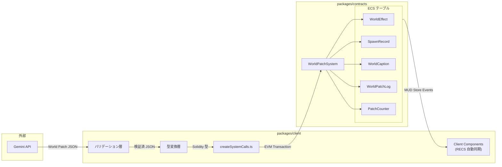
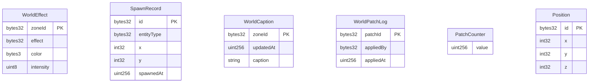
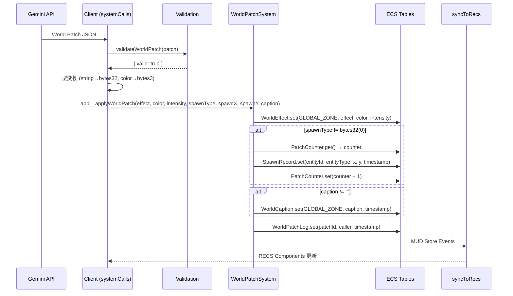

# 技術設計書: MUD世界状態同期基盤 (feature-mud-world)

## 1. アーキテクチャパターンと境界マップ

### 全体アーキテクチャ

本機能は既存の MUD テンプレートアーキテクチャを拡張し、Gemini が生成する世界パッチ JSON をオンチェーン ECS テーブルに反映する同期基盤を提供する。



### 境界定義

| 境界 | 入力側 | 出力側 | プロトコル |
|---|---|---|---|
| Gemini → クライアント | Gemini API | バリデーション層 | JSON (本仕様スコープ外) |
| クライアント → チェーン | systemCalls | WorldPatchSystem | EVM トランザクション (viem) |
| チェーン → クライアント | MUD Store Events | RECS Components | syncToRecs (自動) |

---

## 2. テクノロジースタックとアライメント

| レイヤー | 技術 | バージョン | 役割 |
|---|---|---|---|
| コントラクト | Solidity + MUD | 0.8.24 / 2.2.23 | テーブル定義・System ロジック |
| ビルド | Foundry + MUD CLI | latest / 2.2.23 | コンパイル・codegen・テスト |
| クライアント通信 | viem | 2.35.1 | 型変換・トランザクション送信 |
| クライアント同期 | @latticexyz/store-sync + recs | 2.2.23 | オンチェーン状態の自動同期 |
| クライアント UI | React + @react-three/fiber | 18.x / 8.x | 状態表示 (本仕様スコープ外) |

**ステアリングとの整合**: `tech.md` に定義された `mud.config.ts` をスキーマの単一情報源とする方針に完全準拠。

---

## 3. データモデル

### 3.1 ECS テーブルスキーマ (mud.config.ts)



### 3.2 mud.config.ts テーブル定義仕様

#### WorldEffect (要件 1.1)

```
テーブル名: WorldEffect
namespace: app
キー: [zoneId: bytes32]
値フィールド:
  - effect: bytes32    — 効果タイプ識別子 (例: stringToHex("aurora"))
  - color: bytes3      — RGB カラー値 (例: 0xFF00FF)
  - intensity: uint8   — 効果強度 (0-100)
ストレージ特性: 全フィールド固定長 (static)
```

#### SpawnRecord (要件 1.2)

```
テーブル名: SpawnRecord
namespace: app
キー: [id: bytes32]
値フィールド:
  - entityType: bytes32 — エンティティ種別
  - x: int32            — X 座標
  - y: int32            — Y 座標
  - spawnedAt: uint256   — 生成時刻 (block.timestamp)
ストレージ特性: 全フィールド固定長 (static)
```

#### WorldCaption (要件 1.3)

```
テーブル名: WorldCaption
namespace: app
キー: [zoneId: bytes32]
値フィールド:
  - updatedAt: uint256  — 更新時刻 (block.timestamp)
  - caption: string     — キャプションテキスト
ストレージ特性: updatedAt は固定長 (static)、caption は動的長 (dynamic)。MUD制約により静的型を先に配置。
```

#### WorldPatchLog (要件 1.4)

```
テーブル名: WorldPatchLog
namespace: app
キー: [patchId: bytes32]
値フィールド:
  - appliedBy: bytes32  — 適用者アドレス
  - appliedAt: uint256   — 適用時刻 (block.timestamp)
ストレージ特性: 全フィールド固定長 (static)
```

#### PatchCounter (補助テーブル)

```
テーブル名: PatchCounter
namespace: app
キー: [] (シングルトン)
値フィールド:
  - value: uint256      — 現在のカウンタ値
ストレージ特性: 固定長 (static)
用途: パッチ ID とエンティティ ID の一意生成
```

---

## 4. コンポーネントとインターフェース契約

### 4.1 WorldPatchSystem コントラクト (要件 2.1 - 2.4)

**ファイル**: `packages/contracts/src/systems/WorldPatchSystem.sol`
**基底クラス**: `System` (`@latticexyz/world/src/System.sol`)

#### メソッド仕様

##### applyWorldPatch (要件 2.1)

```
関数名: applyWorldPatch
可視性: public (external via World proxy)
パラメータ:
  - effect: bytes32     — 効果タイプ
  - color: bytes3       — RGB カラー
  - intensity: uint8    — 強度 (0-100)
  - spawnType: bytes32  — 生成エンティティ種別 (bytes32(0) でスキップ)
  - spawnX: int32       — 生成 X 座標
  - spawnY: int32       — 生成 Y 座標
  - caption: string     — キャプション
戻り値: なし
事前条件:
  - intensity <= 100 (違反時 revert)
事後条件:
  - WorldEffect[GLOBAL_ZONE] が更新される
  - spawnType != bytes32(0) の場合、SpawnRecord に新エントリ追加
  - caption が空でない場合、WorldCaption[GLOBAL_ZONE] が更新される
  - WorldPatchLog に新エントリ追加
  - PatchCounter がインクリメントされる
定数:
  - GLOBAL_ZONE = bytes32(0)  — MVP でのグローバルスコープ識別子
```

##### setEffect (要件 2.2)

```
関数名: setEffect
可視性: public
パラメータ:
  - zoneId: bytes32     — ゾーン識別子
  - effect: bytes32     — 効果タイプ
  - color: bytes3       — RGB カラー
  - intensity: uint8    — 強度 (0-100)
戻り値: なし
事前条件:
  - intensity <= 100 (違反時 revert "Intensity must be <= 100")
事後条件:
  - WorldEffect[zoneId] が更新される
```

##### spawnEntity (要件 2.3)

```
関数名: spawnEntity
可視性: public
パラメータ:
  - entityType: bytes32 — エンティティ種別
  - x: int32            — X 座標
  - y: int32            — Y 座標
戻り値: bytes32 (生成されたエンティティ ID)
事前条件: なし
事後条件:
  - 一意のエンティティ ID が生成される
  - SpawnRecord[entityId] に (entityType, x, y, block.timestamp) が格納される
  - PatchCounter がインクリメントされる
ID 生成ロジック:
  - counter = PatchCounter.get() + 1
  - entityId = keccak256(abi.encodePacked(msg.sender, block.timestamp, counter))
  - PatchCounter.set(counter)
```

##### setCaption (要件 2.4)

```
関数名: setCaption
可視性: public
パラメータ:
  - zoneId: bytes32     — ゾーン識別子
  - caption: string     — キャプション
戻り値: なし
事前条件: なし
事後条件:
  - WorldCaption[zoneId] が (caption, block.timestamp) で更新される
```

---

### 4.2 クライアント systemCalls (要件 3.2)

**ファイル**: `packages/client/src/mud/createSystemCalls.ts`

#### 型定義

```typescript
// Gemini が出力する世界パッチ JSON の型
interface WorldPatchJSON {
  effect: string;
  color: string;        // "#RRGGBB" 形式
  intensity: number;    // 0-100 整数
  spawn: {
    type: string;
    x: number;
    y: number;
  } | null;
  caption: string;
}

// バリデーション結果
interface ValidationResult {
  valid: boolean;
  errors: string[];
}
```

#### 関数仕様

##### applyWorldPatch

```
関数名: applyWorldPatch
パラメータ: patch: WorldPatchJSON
戻り値: Promise<void>
処理フロー:
  1. validateWorldPatch(patch) を実行
  2. 検証失敗時: Error を throw (トランザクション送信しない)
  3. 型変換:
     - effect → stringToHex(patch.effect, { size: 32 })
     - color  → parseColorToBytes3(patch.color)  // "#FF00FF" → "0xFF00FF"
     - intensity → そのまま (number → uint8)
     - spawnType → patch.spawn ? stringToHex(patch.spawn.type, { size: 32 }) : "0x" + "00".repeat(32)
     - spawnX, spawnY → patch.spawn ? [x, y] : [0, 0]
     - caption → そのまま (string)
  4. worldContract.write.app__applyWorldPatch([...args]) を呼び出し
  5. waitForTransaction(tx) で確認を待機
```

##### setEffect / spawnEntity / setCaption

```
個別関数も同様のパターンで実装。
型変換はそれぞれのメソッドに対応するサブセットを適用。
```

---

### 4.3 バリデーション層 (要件 4.1)

**配置**: `createSystemCalls.ts` 内のプライベート関数として実装

#### validateWorldPatch 仕様

```
関数名: validateWorldPatch
パラメータ: patch: WorldPatchJSON
戻り値: ValidationResult

検証ルール:
  1. effect: typeof === "string" && length > 0
  2. color: /^#[0-9A-Fa-f]{6}$/ にマッチ
  3. intensity: Number.isInteger(intensity) && 0 <= intensity <= 100
  4. spawn (存在する場合):
     - type: typeof === "string" && length > 0
     - x: Number.isInteger(x)
     - y: Number.isInteger(y)
  5. caption: typeof === "string" (空文字許容)
```

#### parseColorToBytes3 仕様

```
関数名: parseColorToBytes3
パラメータ: color: string  // "#RRGGBB"
戻り値: Hex  // "0xRRGGBB"
処理: color.replace("#", "0x") → `0x${string}` as Hex
```

---

## 5. シーケンス図

### 世界パッチ適用フロー



---

## 6. ファイル変更マップ

### 変更ファイル

| ファイル | 操作 | 要件 |
|---|---|---|
| `packages/contracts/mud.config.ts` | 変更 | 1.1, 1.2, 1.3, 1.4 |
| `packages/contracts/src/systems/WorldPatchSystem.sol` | 新規 | 2.1, 2.2, 2.3, 2.4 |
| `packages/contracts/test/WorldPatchSystemTest.t.sol` | 新規 | 6.1 |
| `packages/client/src/mud/createSystemCalls.ts` | 変更 | 3.2, 4.1 |

### 自動再生成ファイル (`mud build`)

| ファイル | 操作 |
|---|---|
| `packages/contracts/src/codegen/index.sol` | 再生成 |
| `packages/contracts/src/codegen/tables/WorldEffect.sol` | 新規生成 |
| `packages/contracts/src/codegen/tables/SpawnRecord.sol` | 新規生成 |
| `packages/contracts/src/codegen/tables/WorldCaption.sol` | 新規生成 |
| `packages/contracts/src/codegen/tables/WorldPatchLog.sol` | 新規生成 |
| `packages/contracts/src/codegen/tables/PatchCounter.sol` | 新規生成 |
| `packages/contracts/src/codegen/world/IWorld.sol` | 再生成 |
| `packages/contracts/src/codegen/world/IWorldPatchSystem.sol` | 新規生成 |

### 変更不要ファイル

| ファイル | 理由 |
|---|---|
| `setupNetwork.ts` | `syncToRecs(mudConfig)` が新テーブルを自動同期 |
| `createClientComponents.ts` | `...components` スプレッドで自動公開 |
| `MUDContext.tsx` | 型は `SetupResult` から自動推論 |
| `MoveSystem.sol` | 独立した System、影響なし |

---

## 7. テスト戦略 (要件 6.1)

### コントラクトテスト

**ファイル**: `packages/contracts/test/WorldPatchSystemTest.t.sol`
**基底クラス**: `MudTest`

| テストケース | 検証内容 | 対応要件 |
|---|---|---|
| `testApplyWorldPatch_updatesAllTables` | 4テーブル同時更新の正常系 | 2.1 |
| `testApplyWorldPatch_skipsSpawnWhenZeroType` | spawnType=0 で SpawnRecord スキップ | 2.1, 7 |
| `testSetEffect_revertsOnHighIntensity` | intensity > 100 で revert | 2.2 |
| `testSetEffect_updatesWorldEffect` | WorldEffect 正常更新 | 2.2 |
| `testSpawnEntity_uniqueIds` | 連続呼び出しで異なる entityId | 2.3 |
| `testSpawnEntity_setsTimestamp` | spawnedAt が block.timestamp | 2.3 |
| `testSetCaption_updatesWithTimestamp` | caption と updatedAt の更新 | 2.4 |
| `testApplyWorldPatch_incrementsCounter` | PatchCounter のインクリメント | 2.1 |

---

## 8. 設計判断の記録

| 判断 | 選択 | 根拠 |
|---|---|---|
| System 構成 | 単一 WorldPatchSystem | ハッカソン時間制約、一括操作の自然さ |
| カウンタ管理 | PatchCounter シングルトンテーブル | MUD 哲学準拠、クライアント可視性 |
| ゾーン管理 | MVP はグローバル (bytes32(0)) | スコープ方針に従い段階的拡張 |
| バリデーション配置 | systemCalls 内インライン | 追加ファイル不要、十分な分離 |
| カラー表現 | bytes3 (RGB) | MUD ネイティブサポート確認済み |

---

## 9. 要件トレーサビリティ

| 要件 ID | 設計コンポーネント | セクション |
|---|---|---|
| 1.1 | WorldEffect テーブル定義 | 3.2 |
| 1.2 | SpawnRecord テーブル定義 | 3.2 |
| 1.3 | WorldCaption テーブル定義 | 3.2 |
| 1.4 | WorldPatchLog テーブル定義 | 3.2 |
| 2.1 | WorldPatchSystem.applyWorldPatch | 4.1 |
| 2.2 | WorldPatchSystem.setEffect | 4.1 |
| 2.3 | WorldPatchSystem.spawnEntity | 4.1 |
| 2.4 | WorldPatchSystem.setCaption | 4.1 |
| 3.1 | RECS 自動同期 (変更不要) | 6 |
| 3.2 | createSystemCalls.ts 拡張 | 4.2 |
| 4.1 | validateWorldPatch 関数 | 4.3 |
| 5.1 | mud.config.ts 拡張 (Position 保持) | 3.2 |
| 6.1 | WorldPatchSystemTest.t.sol | 7 |
| 7 | spawn スキップ条件分岐 | 4.1 (applyWorldPatch 事後条件) |
| 8 | MUD v2.2.23 互換 | 2 |
