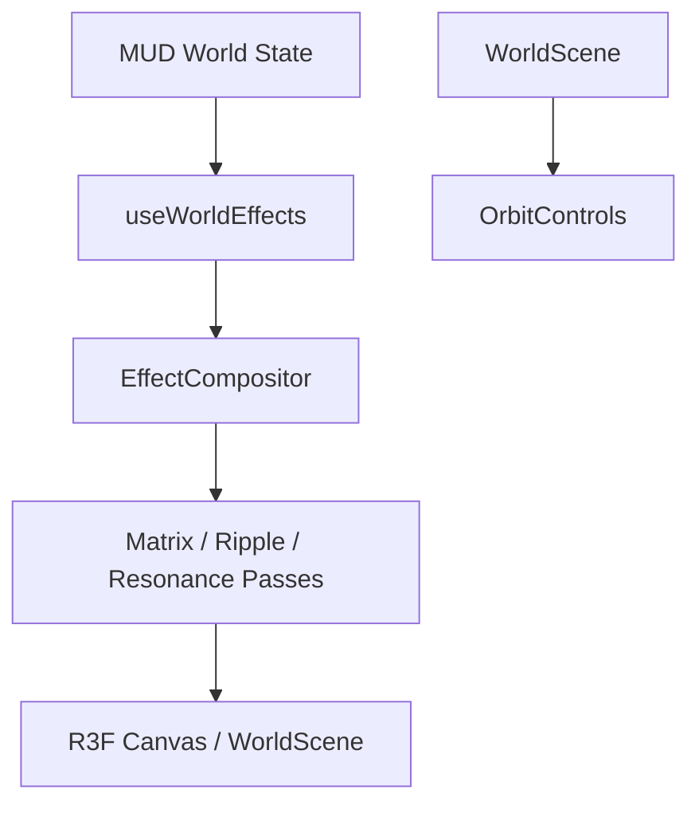

# Technical Design: feature-threejs-world

## Overview
この機能は、MUD オンチェーン状態（`WorldEffect` テーブル）に連動してリアルタイムに変化する、高品質なマトリックス風 3D 世界描画環境を提供します。
プレイヤーはサイバーパンクな視覚体験の中で、オンチェーンイベント（パッチ適用等）が即座に世界の状態変化として波及する様子を視認できます。

### Goals
- React Three Fiber (R3F) を使用した、高品質で一貫したマトリックス風ビジュアルの提供 (1.1)
- オンチェーンの `WorldEffect` データを、遅延なく Ripple や Resonance などの視覚効果へ変換 (2.1)
- 複数エフェクト重畳時の可読性とパフォーマンスの維持 (3.1, 5.1)
- `packages/client` の既存 MUD コンテキストとの安全な統合 (4.1)

### Non-Goals
- 物理演算に基づく詳細な流体シミュレーション
- 永続的な 3D オブジェクトのフルスクラッチモデリング（基本プリミティブとシェーダー演出を優先）

## Architecture

### Architecture Pattern & Boundary Map
本機能は、MUD から供給される「状態 (State)」を、Reactive に「演出 (Visual Effects)」へとマッピングする単方向データフローを採用します。



### Technology Stack

| Layer | Choice / Version | Role in Feature | Notes |
|-------|------------------|-----------------|-------|
| Frontend | React 18+ | UI Framework | |
| 3D Rendering | @react-three/fiber | React/Three.js Bridge | |
| Post-processing | @react-three/postprocessing | VFX Pipeline | Bloom, Scanline, Custom Shaders |
| State Sync | Lattice MUD (RECS) | On-chain data sync | WorldEffect component hooks |

## Requirements Traceability

| Requirement | Summary | Components | Interfaces | Flows |
|-------------|---------|------------|------------|-------|
| 1.1 | Matrix ビジュアル | `WorldScene`, `MatrixEffects` | `MatrixEffectsProps` | 初期表示 |
| 2.1 | 即時エフェクト反映 | `useWorldEffects`, `WorldEffectRenderer` | `WorldEffectData` | エフェクト受信時 |
| 3.1 | 重畳時の整合性 | `EffectCompositor` | `CompositingLogic` | 複数エフェクト発生時 |
| 4.1 | MUD 統合 | `useMUD`, `useWorldEffects` | `MUDContext` | データ供給時 |
| 5.1 | デモ品質/安定性 | `EffectCompositor` | `PerformanceTiers` | 高負荷時 |

## Components and Interfaces

### Rendering Layer

| Component | Domain/Layer | Intent | Req Coverage | Key Dependencies |
|-----------|--------------|--------|--------------|------------------|
| `WorldScene` | Core UI | 3D 空間の基礎（グリッド、光源）を構成 | 1.1 | Drei, Three.js |
| `EffectCompositor` | VFX Logic | MUD 状態に応じたポスト処理のオーケストレーション | 3.1, 5.1 | Postprocessing |
| `WorldEffectRenderer`| VFX Logic | 個別のオンチェーンエフェクトを 3D オブジェクト/光として描画 | 2.1 | `useWorldEffects` |

#### [Component] EffectCompositor
**Responsibilities**:
- `useWorldEffects` から現在有効なエフェクトリストを取得
- 同時実行されるポスト処理パスのパラメータ（intensity, opacity）を動的に調整
- フレームタイムを監視し、LOD (Level of Detail) ティアに従って重いパスを省略

**Service Interface**:
```typescript
interface PerformanceTiers {
  tier: 'High' | 'Medium' | 'Low';
  enabledPasses: string[];
  maxActiveEffects: number;
}
```

#### [Component] useWorldEffects (Hook)
**Intent**: MUD `WorldEffect` コンポーネントの React 向け購読インターフェース。
**Service Interface**:
```typescript
export interface WorldEffectData {
  zoneId: string;
  effect: 'ripple' | 'resonance' | 'neon' | 'scanline';
  color: string;
  intensity: number;
}
export const useWorldEffects = (): WorldEffectData[];
```

## Data Models

### Domain Model (MUD Schema)
- **WorldEffect Table**:
  - `zoneId`: bytes32 (Key)
  - `effect`: bytes32
  - `color`: bytes3 (HEX color)
  - `intensity`: uint32 (0-100)

## Testing Strategy
- **Unit Tests**: `useWorldEffects` フックが MUD component の更新を正しく React state へ反映できるかの検証。
- **Integration Tests**: 3 件以上の `WorldEffect` が重畳した際の `EffectCompositor` による負荷制限（LOD）の発動確認。
- **UI Tests**: `OrbitControls` によるカメラ移動がエフェクト描画を妨げないことの目視確認。
