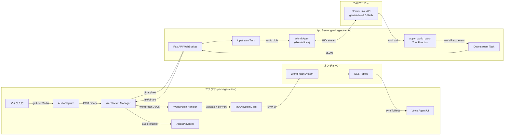
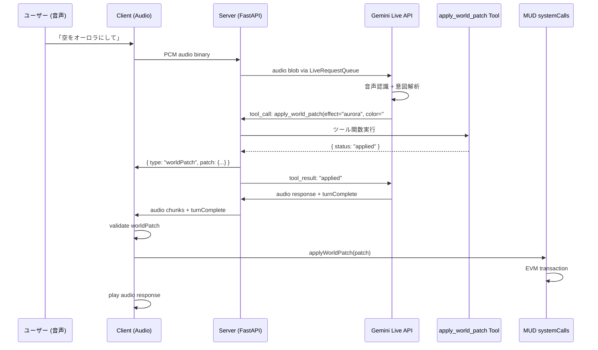

# 技術設計書: 音声AIエージェント基盤 (feature-voice-agent)

## 1. アーキテクチャパターンと境界マップ

### 全体アーキテクチャ



### 境界定義

| 境界                                   | プロトコル             | データ形式                             |
| -------------------------------------- | ---------------------- | -------------------------------------- |
| ブラウザ ↔ App Server                  | WebSocket (ws://)      | binary (PCM) + JSON text               |
| App Server ↔ Gemini                    | ADK LiveRequestQueue   | audio blob + content                   |
| App Server → クライアント (世界パッチ) | WebSocket JSON         | `{ type: "worldPatch", patch: {...} }` |
| クライアント → MUD                     | EVM Transaction (viem) | Solidity ABI encoded                   |

---

## 2. テクノロジースタックとアライメント

| レイヤー     | 技術                               | バージョン        | 役割                       |
| ------------ | ---------------------------------- | ----------------- | -------------------------- |
| App Server   | Python + FastAPI                   | 3.10+ / >=0.115.0 | WebSocket エンドポイント   |
| AI 統合      | google-adk                         | >=1.22.1          | Gemini Live API ラッパー   |
| AI モデル    | gemini-live-2.5-flash-native-audio | -                 | リアルタイム音声処理       |
| ASGI         | uvicorn                            | >=0.32.0          | HTTP/WS サーバー           |
| クライアント | React + TypeScript                 | 18.x / 5.4.x      | UI + 音声処理              |
| 音声 API     | Web Audio API + MediaStream        | -                 | ブラウザネイティブ         |
| MUD 統合     | @latticexyz/\* + viem              | 2.2.23 / 2.35.1   | オンチェーン書き込み       |
| 開発プロキシ | Vite server.proxy                  | 4.x               | WebSocket フォワーディング |

**ステアリングとの整合**:

- `tech.md`: クライアントは React + Vite + TypeScript の方針に準拠
- `structure.md`: `packages/server/` を新設し、既存の `packages/` 構成に従う
- `product.md`: 「入力が即座に世界に反映」「共有可能な世界状態」の原則に準拠

---

## 3. データフローとメッセージプロトコル

### 3.1 WebSocket メッセージプロトコル

#### Upstream（クライアント → サーバー）

| メッセージ種別 | 形式                                | 説明                        |
| -------------- | ----------------------------------- | --------------------------- |
| 音声データ     | binary                              | 16-bit PCM, 16kHz, モノラル |
| テキスト入力   | `{ "type": "text", "text": "..." }` | テキストコマンド            |

#### Downstream（サーバー → クライアント）

| メッセージ種別 | 形式                                                | 説明                             |
| -------------- | --------------------------------------------------- | -------------------------------- |
| ADK イベント   | ADK Event JSON                                      | 音声応答、トランスクリプション等 |
| 世界パッチ     | `{ "type": "worldPatch", "patch": WorldPatchJSON }` | ツール呼び出し結果               |
| エラー         | `{ "error": { "message": "..." } }`                 | サーバーエラー                   |

### 3.2 世界パッチイベントフロー（ツール呼び出し方式）



---

## 4. コンポーネントとインターフェース契約

### 4.1 App Server: packages/server/

#### ディレクトリ構造

```
packages/server/
├── main.py                 # FastAPI app + WebSocket endpoint
├── agent/
│   └── world_agent.py      # Gemini Live agent + world patch tool
├── pyproject.toml           # Python dependencies
├── .dockerignore
├── deploy.sh
├── cleanup.sh
├── Dockerfile
├── pyproject.toml           # Python dependencies
├── .env.example             # 環境変数テンプレート
└── .env                     # 実際の環境変数 (gitignore)
```

#### world_agent.py — エージェント定義 (要件 1.4, 1.5)

```
エージェント名: ego_world_agent
モデル: gemini-live-2.5-flash-native-audio
ツール: [apply_world_patch]
instruction:
  - あなたは Echo Genesis Online (EGO) の世界管理 AI です
  - ユーザーの音声入力を解釈し、世界を変化させるコマンドを検出してください
  - 世界変更コマンドを検出したら、apply_world_patch ツールを呼び出してください
  - コマンドでない通常の会話には音声で応答してください
```

#### apply_world_patch ツール仕様

```
関数名: apply_world_patch
パラメータ:
  - effect: str          — 効果タイプ (例: "aurora", "storm", "calm")
  - color: str           — hex カラー (例: "#7B68EE")
  - intensity: int       — 強度 (0-100)
  - spawn_type: str      — 生成エンティティ種別 (空文字でスキップ)
  - spawn_x: int         — 生成 X 座標
  - spawn_y: int         — 生成 Y 座標
  - caption: str         — 世界変化の説明テキスト
戻り値: dict — { "status": "applied", "patch": { ... } }
副作用: WebSocket 経由でクライアントに worldPatch イベントを送信
```

#### main.py — WebSocket エンドポイント (要件 1.1, 1.2, 1.3)

```
エンドポイント: /ws/{user_id}/{session_id}
RunConfig:
  - streaming_mode: StreamingMode.BIDI
  - response_modalities: ["AUDIO"]
  - input_audio_transcription: enabled
  - output_audio_transcription: enabled

upstream_task:
  - binary メッセージ → audio blob (audio/pcm;rate=16000)
  - JSON { type: "text" } → Content with text Part

downstream_task:
  - ADK Event → JSON text via WebSocket
  - ツール呼び出し結果中に worldPatch データ → { type: "worldPatch", patch: {...} }
  - エラー → { error: { message: "..." } }
```

---

### 4.2 クライアント音声モジュール: packages/client/src/

#### ディレクトリ構造

```
packages/client/src/
├── audio/
│   ├── capture.ts              # マイク入力キャプチャ
│   ├── playback.ts             # 音声応答再生
│   └── pcm-utils.ts            # PCM 変換ユーティリティ
├── connection/
│   ├── connection-state-machine.ts  # 接続状態マシン
│   └── websocket-manager.ts         # WebSocket 接続管理
├── voice/
│   ├── types.ts                # 型定義
│   ├── world-patch-handler.ts  # 世界パッチ抽出・適用
│   └── useVoiceAgent.ts        # 統合 React フック
└── (既存ファイル)
```

#### 型定義 — types.ts (全要件の型基盤)

```typescript
// 接続状態
type ConnectionState = "disconnected" | "connecting" | "connected" | "reconnecting" | "error";

// WebSocket メッセージ（Downstream）
type DownstreamMessage =
  | { type: "worldPatch"; patch: WorldPatchJSON }
  | { type: "adkEvent"; payload: AdkEventPayload }
  | { type: "error"; message: string };

// ADK イベント
interface AdkEventPayload {
  author?: string;
  turnComplete?: boolean;
  interrupted?: boolean;
  error?: string | { message?: string };
  outputTranscription?: { text?: string };
  content?: { parts?: AdkEventPart[] };
}

interface AdkEventPart {
  text?: string;
  inlineData?: { mimeType?: string; data?: string };
}

// 世界パッチ JSON（feature-mud-world と共有）
interface WorldPatchJSON {
  effect: string;
  color: string;
  intensity: number;
  spawn: { type: string; x: number; y: number } | null;
  caption: string;
}

// 会話メッセージ
interface ConversationMessage {
  id: string;
  role: "user" | "agent" | "system";
  content: string;
  status: "partial" | "complete";
}
```

#### connection-state-machine.ts (要件 2.2)

```
状態遷移:
  disconnected → CONNECT_REQUESTED → connecting
  connecting → CONNECTED → connected
  connecting → CONNECTION_ERROR → error
  connected → DISCONNECTED → disconnected
  connected → CONNECTION_ERROR → error
  error → RECONNECT_REQUESTED → reconnecting
  reconnecting → CONNECTED → connected
  reconnecting → CONNECTION_ERROR → error

関数:
  connectionStateMachine(state, event) → ConnectionState
  getConnectionStateLabel(state) → string (日本語ラベル)
```

#### capture.ts — マイク入力キャプチャ (要件 2.1)

```
関数: startAudioCapture(onChunk: (pcmData: ArrayBuffer) => void) → AudioCaptureHandle
  - getUserMedia({ audio: true })
  - AudioContext(sampleRate: 16000)
  - ScriptProcessorNode(bufferSize: 4096)
  - float32 → int16 PCM 変換
  - onChunk コールバックで PCM チャンクを返す

関数: stopAudioCapture(handle: AudioCaptureHandle) → void
  - MediaStream トラック停止
  - AudioContext クローズ
  - プロセッサノード切断

型: AudioCaptureHandle
  - stream: MediaStream
  - context: AudioContext
  - processor: ScriptProcessorNode
  - source: MediaStreamAudioSourceNode
```

#### playback.ts — 音声応答再生 (要件 2.4)

```
関数: createAudioPlayback() → AudioPlaybackHandle
  - AudioContext(sampleRate: 24000)
  - nextPlayAt: number (スケジューリング用)

関数: playPcmChunk(handle, base64Data, mimeType) → void
  - base64 → ArrayBuffer デコード
  - サンプルレート解析 (parsePcmRate)
  - AudioBufferSourceNode でスケジュール再生

関数: stopPlayback(handle) → void
  - AudioContext クローズ

関数: interruptPlayback(handle) → void
  - 再生中のノードを停止
  - nextPlayAt リセット
```

#### pcm-utils.ts (要件 5.3 でテスト対象)

```
関数: floatTo16BitPCM(float32: Float32Array) → Int16Array
関数: parsePcmRate(mimeType: string, fallback?: number) → number
関数: decodeBase64ToArrayBuffer(base64: string) → ArrayBuffer
```

#### world-patch-handler.ts (要件 2.3, 3.1)

```
関数: handleDownstreamMessage(message: string) → DownstreamMessage
  - JSON パース
  - type フィールドに基づく判別
  - worldPatch 型の場合は WorldPatchJSON を抽出

関数: applyWorldPatchFromAgent(
  patch: WorldPatchJSON,
  systemCalls: SystemCalls
) → Promise<{ success: boolean; error?: string }>
  - validateWorldPatch(patch) を実行
  - 検証成功時: systemCalls.applyWorldPatch(patch) を呼び出し
  - 検証失敗時: エラーを返す（トランザクション送信しない）
```

#### useVoiceAgent.ts — 統合 React フック (要件 2.2, 2.3, 3.2)

```
フック: useVoiceAgent(systemCalls: SystemCalls) → VoiceAgentState

戻り値:
  - connectionState: ConnectionState
  - isVoiceActive: boolean
  - conversation: ConversationMessage[]
  - lastPatchResult: { success: boolean; error?: string } | null
  - connect: () → void
  - disconnect: () → void
  - toggleVoice: () → void
  - sendText: (text: string) → void

内部ロジック:
  - WebSocket 接続管理（ref ベース）
  - 音声キャプチャ開始/停止
  - Downstream イベント処理
  - 世界パッチの自動適用
  - 音声応答の自動再生
```

---

### 4.3 Vite Proxy 設定 (要件 4.2)

```
// vite.config.ts に追加
server: {
  proxy: {
    "/ws": {
      target: "http://localhost:8000",
      ws: true,
    }
  }
}
```

---

## 5. ファイル変更マップ

### 新規ファイル

| ファイル                                                     | 要件          |
| ------------------------------------------------------------ | ------------- |
| `packages/server/main.py`                                    | 1.1, 1.2, 1.3 |
| `packages/server/agent/world_agent.py`                       | 1.4, 1.5      |
| `packages/server/agent/__init__.py`                          | 1.4           |
| `packages/server/pyproject.toml`                             | 4.1           |
| `packages/server/.env.example`                               | 4.1           |
| `packages/client/src/audio/capture.ts`                       | 2.1           |
| `packages/client/src/audio/playback.ts`                      | 2.4           |
| `packages/client/src/audio/pcm-utils.ts`                     | 2.1, 2.4      |
| `packages/client/src/connection/connection-state-machine.ts` | 2.2           |
| `packages/client/src/connection/websocket-manager.ts`        | 2.2           |
| `packages/client/src/voice/types.ts`                         | 全要件        |
| `packages/client/src/voice/world-patch-handler.ts`           | 2.3, 3.1      |
| `packages/client/src/voice/useVoiceAgent.ts`                 | 2.2, 2.3, 3.2 |

### 変更ファイル

| ファイル                         | 変更内容           | 要件 |
| -------------------------------- | ------------------ | ---- |
| `packages/client/vite.config.ts` | proxy 設定追加     | 4.2  |
| `packages/client/src/App.tsx`    | VoiceAgent UI 統合 | 3.2  |

### 変更不要ファイル

| ファイル                                     | 理由                                        |
| -------------------------------------------- | ------------------------------------------- |
| `packages/contracts/*`                       | feature-mud-world で完了済み                |
| `packages/client/src/mud/*`                  | systemCalls は feature-mud-world で追加済み |
| `packages/client/src/context/MUDContext.tsx` | 型は自動推論                                |

---

## 6. テスト戦略 (要件 5.1, 5.2, 5.3)

| テストファイル                     | テスト内容                                    | 対応要件 |
| ---------------------------------- | --------------------------------------------- | -------- |
| `connection-state-machine.test.ts` | 全状態遷移の検証                              | 5.1      |
| `world-patch-handler.test.ts`      | worldPatch イベント抽出・非パッチテキスト判別 | 5.2      |
| `pcm-utils.test.ts`                | floatTo16BitPCM 変換精度                      | 5.3      |

---

## 7. 設計判断の記録

| 判断                   | 選択                         | 根拠                                                                                 |
| ---------------------- | ---------------------------- | ------------------------------------------------------------------------------------ |
| 世界パッチ生成方式     | ADK Tool Use（関数呼び出し） | Live API で output_schema 未サポート。ツール呼び出しは構造化パラメータの信頼性が高い |
| サーバーアーキテクチャ | 統合型 FastAPI               | ハッカソン時間制約、sample パターンと一致                                            |
| 音声キャプチャ         | ScriptProcessorNode          | deprecated だが安定動作、AudioWorklet は複雑すぎる                                   |
| 音声サンプルレート     | 入力 16kHz / 出力 24kHz      | Gemini Live API の標準仕様                                                           |
| WebSocket 管理         | React ref ベース             | re-render 副作用を回避（sample パターン）                                            |
| Python パッケージ配置  | packages/server/             | monorepo の packages/ 配下で一貫性を維持                                             |

---

## 8. 要件トレーサビリティ

| 要件 ID | 設計コンポーネント                             | セクション |
| ------- | ---------------------------------------------- | ---------- |
| 1.1     | main.py WebSocket endpoint                     | 4.1        |
| 1.2     | main.py upstream_task                          | 4.1        |
| 1.3     | main.py downstream_task                        | 4.1        |
| 1.4     | world_agent.py agent 定義                      | 4.1        |
| 1.5     | apply_world_patch tool 仕様                    | 4.1        |
| 2.1     | capture.ts                                     | 4.2        |
| 2.2     | connection-state-machine.ts, useVoiceAgent.ts  | 4.2        |
| 2.3     | world-patch-handler.ts                         | 4.2        |
| 2.4     | playback.ts                                    | 4.2        |
| 3.1     | world-patch-handler.ts → MUD systemCalls       | 4.2        |
| 3.2     | useVoiceAgent.ts → App.tsx                     | 4.2, 5     |
| 4.1     | packages/server/ 構造                          | 4.1        |
| 4.2     | vite.config.ts proxy                           | 4.3        |
| 5.1     | connection-state-machine.test.ts               | 6          |
| 5.2     | world-patch-handler.test.ts                    | 6          |
| 5.3     | pcm-utils.test.ts                              | 6          |
| 6       | レイテンシ: ツール呼び出し方式で追加遅延最小化 | 7          |
| 7       | セキュリティ: API キーはサーバー側のみ         | 7          |
