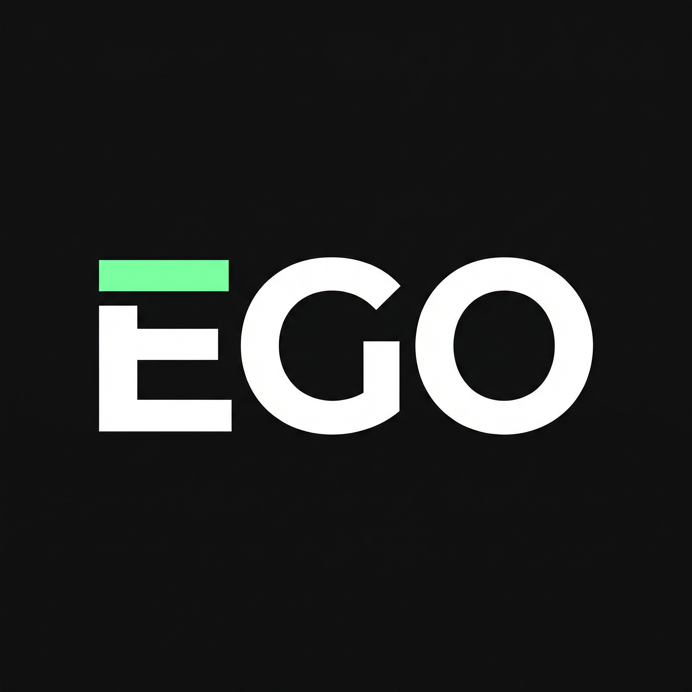
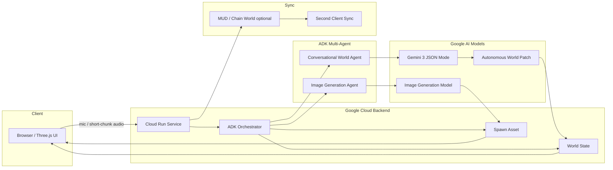

# Autonomous World: Echo Genesis Online (EGO)

<p align="center">
  
</p>

**EGO — A Conversational Autonomous World**

Submission repository for the "Gemini 3 Tokyo Hackathon" held on February 21, 2026.

---

## TL;DR

When you speak to the world—

- **Dialogue → World rules update autonomously** (lights, ripples, resonance change in Three.js)
- **Dialogue → New beings are generated and persist in the world** (Nano Banana)
- **Shared world → Others' dialogue grows the same world** (state sync = consensus)

> A life-simulation where everyone witnesses the same world as it keeps autonomously evolving.

---

## Concept

**EGO** is a 2D pixel life game (god view) where dialogue becomes world patches.

Gemini 3 transforms dialogue into **structured "World Patch (JSON)"** and autonomously updates world rules (environment effects) in Three.js.
At the same time, Nano Banana generates new pixel-art assets and anchors them into the world.

---

## Tech Stack

| Category                | Technologies                                                                                    | Purpose                                                    |
| ----------------------- | ------------------------------------------------------------------------------------------------ | ---------------------------------------------------------- |
| Monorepo/Package Mgmt   | pnpm workspace, Node.js 20+                                                                      | Manage `packages/client` and `packages/contracts`          |
| Frontend                | React 18, Vite 4, TypeScript 5, `@react-three/fiber`                                             | UI rendering, 3D visuals, client implementation            |
| Blockchain Sync         | Lattice MUD (`@latticexyz/*`), viem                                                              | World state sync, RECS integration, client connection      |
| Smart Contracts         | Solidity 0.8.24, Foundry, MUD CLI                                                                | World definitions, System implementation, deploy/test      |
| Dev/Ops Support         | mprocs, ESLint, Prettier, solhint                                                                | Parallel dev, quality checks, formatting/static analysis   |
| GenAI Integration (Plan)| Gemini 3 (JSON Mode), Nano Banana, ADK Orchestrator, Cloud Run, Artifact Registry, ADK, Python   | Voice → world patch, asset generation, orchestration       |

---

## Why Now?

Even as AI and UGC advance, the excitement doesn't compound. The root causes:

- GenAI outputs are often **ephemeral (they disappear)**
- UGC is **expensive to create**
- Web3 often **stops at ownership**

EGO’s core target:

> **Witnessing the same world as it keeps autonomously evolving (sharing = consensus).**

## World Patch (Fixed Schema)

Gemini 3 outputs a **fixed-schema JSON** from speech, like this:

```json
{
  "effect": "resonance_ripple",
  "color": "#7CFFB2",
  "intensity": 0.8,
  "spawn": "music_dragon_totem",
  "caption": "共鳴律が宇宙に追加された"
}
```

- `effect`:
  Environment effect type (e.g. `resonance_ripple` / `neon_fog` / `scanline_burst`)
- `color`:
  Effect color
- `intensity`:
  Strength (0.0–1.0)
- `spawn`:
  Spawn entity ID (e.g. `music_dragon_totem`)
- `caption`:
  Short UI caption (commentary/description)

---

## Feature List (MoSCoW)

| Priority   | Feature                                    | Demo Value                              | How to Demo                                 | MVP Scope                                                  | Fallback             |
| ---------- | ------------------------------------------- | -------------------------------------- | ------------------------------------------- | -------------------------------------------------------- | -------------------- |
| **Must**   | High-quality Three.js world rendering (matrix-like UI) | Grab the world feel in 10 seconds     | Neon/scanlines/particles/bloom              | 2D/pseudo-2D is OK, go all-in on effects                | Simplify effects     |
| **Must**   | Voice → Gemini(JSON) → world patch generation          | Make “voice compiles the world” real  | Overlay patch JSON top-right                | Fixed schema only / short-chunk audio “pseudo-streaming” | Switch to text input |
| **Must**   | World state → environment effects (light/ripple/resonance) | Instantly show “rules changed”      | Color/ripple/glow change                     | Param toggle only (no physics)                          | Color change only    |
| **Should** | Asset generation & spawn (buildings/totems, etc.)       | Changes persist in the world          | Generate → place in world                    | One entity is enough, fixed coordinates OK              | 3 backup sprites     |
| **Should** | NPC/monster spawn (with attributes)                     | Show fun via characters               | Spawn + attribute tags                       | No behavior AI (static/simple animation)                | Template monster + captions |

---

## Architecture (Overview)



Key points:

- The backend runs on **Cloud Run**, simplifying operations through a single entry point
- **ADK Orchestrator** manages control, splitting **conversational** and **image generation** agents
- The conversational side uses **Gemini 3 (JSON Mode)** to generate fixed-schema JSON and apply it safely to world state
- The image generation side creates assets via a dedicated agent and spawns them into the world
- The on-chain value is **shared-world consensus**, not assetization (same world state sync)

---

## Demo Flow (2 minutes, no slides)

1. Open the world view (matrix-like UI visible)
2. Turn on the mic and speak a short line
   Example: "In the wasteland, a lonely dragon king who loves music."
3. **Patch JSON** appears top-right and **light/ripple/resonance** changes autonomously
4. Image-generation output persists in the world
5. (If possible) Show the same change synced in another tab/device

---

## Quick Start (Local)

> This repository uses **pnpm workspace** (`packages/client` + `packages/contracts`).

### 1) Requirements

- Node.js 20+
- pnpm 9+
- Foundry / Anvil (`anvil` command available)

### 2) Install

```bash
pnpm install
```

### 3) Environment Variables

Copy `packages/contracts/.env.example` to create `.env`.

```bash
cp packages/contracts/.env.example packages/contracts/.env
```

In `packages/client/.env`, set at minimum `VITE_CHAIN_ID=31337`.

```bash
echo "VITE_CHAIN_ID=31337" > packages/client/.env
```

Example `packages/contracts/.env.example`:

```env
# Enable debug logs for MUD CLI
DEBUG=mud:*

# Anvil default private key:
PRIVATE_KEY=0xac0974bec39a17e36ba4a6b4d238ff944bacb478cbed5efcae784d7bf4f2ff80
```

### 4) Run

Start everything (recommended):

```bash
pnpm dev
```

This launches `anvil / contracts / client / explorer` concurrently via `mprocs`.

Start individually:

```bash
anvil --base-fee 0 --block-time 2
pnpm --filter contracts dev
pnpm --filter client dev
```

Open in the browser (example):

- `http://localhost:5173`

### 5) Deploy/Destroy the Voice AI Agent

Build the Docker container first:

```bash
pnpm run server build
```

Deploy to Cloud Run:

```bash
pnpm run server deploy2cloudrun
```

Cleanup:

```bash
pnpm run server cleanup
```

---

## Directory Structure

```
.
├─ packages/
│  ├─ client/               # Frontend (Vite + React + MUD client)
│  │  ├─ src/
│  │  │  ├─ context/
│  │  │  │  └─ MUDContext.tsx
│  │  │  ├─ hooks/
│  │  │  │  └─ useKeyboardMovement.ts
│  │  │  ├─ App.tsx
│  │  │  └─ mud/
│  │  └─ vite.config.ts
│  └─ contracts/            # Smart contracts (MUD / Foundry)
│     ├─ src/
│     │  ├─ systems/
│     │  └─ codegen/
│     ├─ mud.config.ts
│     └─ foundry.toml
├─ design/
│  └─ pencil-new.pen        # UI design file
├─ sample/
│  ├─ fullstack-voice-ai-agent/. # Reference (ADK realtime voice AI agent)
│  ├─ isometric-rpg/             # Reference (Three.js)
│  ├─ my-ts-agent/               # Reference (TypeScript Agent)
│  └─ nano-banana/               # Reference (image generation)
├─ pnpm-workspace.yaml
├─ package.json
├─ tsconfig.json
└─ README.md
```

---

## Key Implementation Choices (for stability)

### 1) “Streaming” wins by being pseudo-streaming

- Appearance: immediate reaction to speech (live feel)
- Reality: send audio in **1–2 second chunks** (opt for reliability)

### 2) JSON is fixed schema (no free text)

- Accept only `effect / color / intensity / spawn / caption`
- Drop extra strings to avoid demo accidents

### 3) Nano Banana is not the protagonist

- The protagonist is changing world rules (Three.js)
- Even if generation fails, **backup sprites** keep the demo intact

## Hackathon Page

- [https://cerebralvalley.ai/e/gemini-3-tokyo-hackathon](https://cerebralvalley.ai/e/gemini-3-tokyo-hackathon)

---

## License

- TODO:
