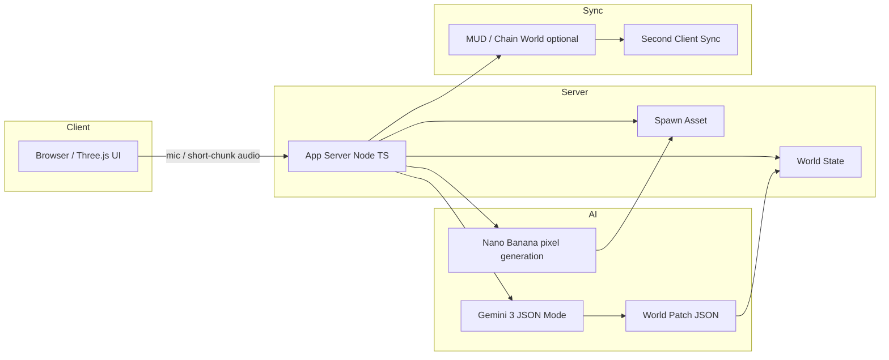

# 202602-Gemini3-Tokyo-Hackathon

**Echo Genesis Online (EGO)**

2026年2月21日開催「Gemini 3 東京ハッカソン」提出リポジトリです。

---

## TL;DR

あなたが一言しゃべると──

- **声 → 世界ルールが即時に変わる**（Three.jsで光・波紋・共鳴が変化）
- **声 → ドット絵の存在が生成されて出現**（Nano Banana）
- **別タブ/別端末でも同じ変化が同期**（ブロックチェーンで世界状態を共有＝合意形成）

> “世界が変わる瞬間”を、みんなが同じ世界として目撃できる新しいライフゲームの形。

---

## コンセプト

**EGO** は「声＝世界パッチ」の2Dドット・ライフゲーム（神視点）です。

Gemini 3 が音声を **構造化された「世界パッチ(JSON)」** に変換し、Three.js 上の世界法則（環境エフェクト）を即時更新します。
同時に Nano Banana が新しいドット絵アセットを生成し、世界にスポーンさせます。

---

## Why Now（なぜ今？）

AIやUGCが発展しても、熱狂が増幅しない根因はここです：

- 生成AIの出力は **その場限り（消える）** になりがち
- UGCは **作る工数が重い**
- Web3は **所有の話で止まりがち**

EGOが狙う本丸はこれ：

> **「世界が変わる瞬間」を、みんなが同じ世界として目撃できる（共有＝合意形成）**

## 世界パッチ（固定スキーマ）

Gemini 3 は発話から、以下のような **固定スキーマJSON** を出力します。

```json
{
  "effect": "resonance_ripple",
  "color": "#7CFFB2",
  "intensity": 0.8,
  "spawn": "music_dragon_totem",
  "caption": "共鳴律が宇宙に追加された"
}
```

- `effect`:
  環境エフェクト種別（例：`resonance_ripple` / `neon_fog` / `scanline_burst`）
- `color`:
  エフェクト色.
- `intensity`:
  強度（0.0〜1.0）
- `spawn`:
  スポーンする存在ID（例：`music_dragon_totem`）
- `caption`:
  UI表示用の短文（実況/説明）

---

## 機能一覧（MoSCoW）

| 区分       | 機能名                                      | 目的（デモで伝わる価値）               | デモでの見せ方                              | 実装スコープ（MVPの線引き）                              | 失敗時フォールバック |
| ---------- | ------------------------------------------- | -------------------------------------- | ------------------------------------------- | -------------------------------------------------------- | -------------------- |
| **Must**   | Three.js 高品質世界描画（マトリックス風UI） | 開幕10秒で世界観を掴ませる             | ネオン/スキャンライン/パーティクル/ブルーム | 2D/擬似2DでOK。演出に全振り                              | 演出を1段落とす      |
| **Must**   | 音声→Gemini(JSON)→世界パッチ生成            | 「声が世界をコンパイル」を成立させる核 | 右上にパッチJSONをオーバーレイ              | 固定スキーマのみ／音声は短区切り送信で“ストリーミング風” | テキスト入力に切替   |
| **Must**   | 世界状態→環境エフェクト反映（光/波紋/共鳴） | 「ルールが変わった」が一瞬で分かる     | 色調/波紋/発光強度が即変化                  | パラメータ切替で十分（物理はやらない）                   | 色変化だけに単純化   |
| **Should** | アセット生成＆スポーン（建物/トーテム等）   | 変化が“世界の中に残る”感               | 生成→世界に配置                             | 生成は1体でOK。座標固定でも可                            | 予備スプライト3種    |
| **Should** | NPC/怪獣スポーン（属性付き）                | 生成の面白さを“キャラ”で見せる         | スポーン＋属性タグ表示                      | 行動AIなし（静止/簡易アニメ）                            | テンプレ怪獣＋字幕   |

---

## アーキテクチャ（概要）



ポイント：

- UXはライブだが、内部は **短区切り送信**で安定性を優先（“ストリーミング風”）
- 出力は **固定スキーマJSON** で型安全に反映
- 「オンチェーンの価値」は**資産化**ではなく **共有世界の合意形成**（同じ世界状態の同期）

---

## デモ手順（2分・スライド無し）

1. 世界画面を開く（マトリックス風UIが表示されている状態）
2. マイクをONにして短い発話をする
   例：「荒野に、孤独なドラゴンの王を。彼は音楽を愛している」
3. 右上に **パッチJSON** が表示され、世界の **光/波紋/共鳴** が変化する
4. Nano Banana の生成物がスポーンする
5. （可能なら決定打）別タブ/別端末で同じ変化が同期していることを見せる

---

## クイックスタート（ローカル起動）

> このREADMEは「動かせる」ことを優先して、一般的な構成で記載しています。
> 実装が単一アプリの場合でも、envとコマンドだけ合わせればOKです。

### 1) 必要要件

- Node.js 18+（推奨 20+）
- npm / pnpm / yarn いずれか
- Gemini 3 のAPIキー
- Nano Banana のAPIキー/クレジット
- （任意）MUD/チェーン接続情報

### 2) インストール

```bash
npm install
```

### 3) 環境変数

`.env.example` を `.env` にコピーして編集してください。

```bash
cp .env.example .env
```

`.env.example`（例）：

```env
# --- AI ---
GEMINI_API_KEY="YOUR_GEMINI_API_KEY"
GEMINI_MODEL="gemini-3"

# --- Nano Banana ---
NANOBANANA_API_KEY="YOUR_NANOBANANA_API_KEY"
NANOBANANA_MODEL="nano-banana-pro"

# --- Audio / UX ---
AUDIO_CHUNK_MS="1200"              # “ストリーミング風”の短区切り(ミリ秒)
PATCH_TIMEOUT_MS="12000"           # 生成タイムアウト（デモ用に短め推奨）

# --- Shared World (optional) ---
ENABLE_CHAIN_SYNC="false"
RPC_URL=""
WORLD_ID="ego-demo"

# --- App ---
PORT="5173"
```

### 4) 起動

```bash
npm run dev
```

ブラウザで表示（例）：

- `http://localhost:5173`

---

## ディレクトリ構成（例）

```
.
├─ src/
│  ├─ app/                  # UI / 画面
│  ├─ three/                # Three.js scene, shaders, postprocess
│  ├─ audio/                # mic capture, chunking
│  ├─ ai/                   # Gemini client, JSON schema, retry
│  ├─ nanobanana/           # pixel gen client, fallback assets
│  ├─ world/                # world state, patch apply, sync
│  └─ server/               # API routes (if needed)
├─ public/
│  └─ fallback-sprites/     # 予備スプライト（生成失敗時）
├─ .env.example
├─ package.json
└─ README.md
```

---

## 実装の肝（安定して勝つための設計）

### 1) “ストリーミング”は「ストリーミング風」で勝つ

- 見た目：喋ってすぐ反応（ライブ感）
- 中身：音声を **1〜2秒の短区切り**で送る（成功率優先）

### 2) JSONは固定スキーマ（自由文禁止）

- `effect / color / intensity / spawn / caption` のみを受け付ける
- 余計な文字列は捨てる（デモ事故を防ぐ）

### 3) Nano Bananaは“主役ではない”

- 主役：世界ルールが変わる（Three.js）
- 生成失敗しても、**予備スプライト**でスポーンすればデモは成立

## ハッカソン概要ページ

- [https://cerebralvalley.ai/e/gemini-3-tokyo-hackathon](https://cerebralvalley.ai/e/gemini-3-tokyo-hackathon)

---

## ライセンス

- TODO:

```

```
